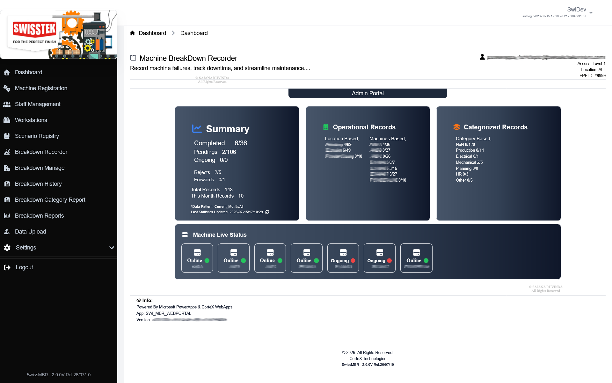

# MBR Web — Machine Breakdown Recorder

## Overview

MBR Web is the next-generation evolution of the original Microsoft Power Apps Machine Breakdown Recorder, rebuilt as a high-performance web application for manufacturing environments.

The platform digitizes the complete machine breakdown lifecycle, from initial operator reporting through supervisory review, downtime calculation, categorization, notifications, reporting and historical analysis.

The system preserves the successful workflow established by the original Power Apps solution while introducing enhanced business rules, faster reporting, advanced analytics and a more flexible web-based architecture.

---

## 🎯 Key Capabilities

- Machine breakdown reporting
- Breakdown lifecycle management
- Supervisory review and approval workflows
- Automated downtime calculation
- Breakdown categorization
- Business rule validation and enforcement
- Operational dashboards
- Historical breakdown analysis
- Email notifications
- Excel export
- PDF reporting
- Advanced operational reporting
- User authentication and access control

---

## 🔐 Enterprise Authentication

MBR Web integrates with Microsoft authentication to allow users to sign in using their organization's Microsoft identity.

The application is connected to the organization's Microsoft Entra ID (formerly Azure Active Directory), allowing authenticated company users to access the platform using their existing corporate credentials.

This provides an enterprise-oriented authentication experience without requiring users to maintain a separate application password.

---

## 🏗️ Technology Stack

### Backend

- Laravel 11
- PHP

### Frontend

- Tailwind CSS
- JavaScript

### Database

- MySQL

### Enterprise Integration

- Microsoft Entra ID
- Microsoft Authentication

### Reporting & Data

- Excel Export
- PDF Reporting
- Operational Dashboards
- Historical Analytics

---

## 🔄 Machine Breakdown Lifecycle

The platform manages the breakdown process from the initial report through analysis and historical reporting.

```text
Machine Breakdown
        ↓
Operator Reporting
        ↓
Automated Validation
        ↓
Breakdown Categorization
        ↓
Supervisory Review
        ↓
Downtime Calculation
        ↓
Notifications
        ↓
Reporting & Analytics
        ↓
Historical Analysis
```

---

## 🎯 Business Objectives

The system was designed to improve the efficiency, accuracy, and visibility of machine breakdown management by:

- Digitizing machine breakdown recording
- Standardizing breakdown information
- Enforcing defined business rules
- Improving downtime calculation accuracy
- Reducing manual reporting effort
- Providing faster access to operational information
- Improving visibility into machine downtime
- Supporting supervisory review and decision-making
- Enabling historical analysis of breakdown trends
- Centralizing operational reporting

---

## 📊 Reporting & Analytics

MBR Web provides reporting and analytical capabilities for operational teams, supervisors, and management.

The reporting functionality supports:

- Breakdown history analysis
- Downtime analysis
- Breakdown categorization
- Operational dashboards
- Historical trend analysis
- PDF report generation
- Excel exports
- Operational data analysis

These capabilities provide users with structured operational information for monitoring machine performance, identifying downtime patterns, and supporting data-driven decision-making.

---

## 👨‍💻 My Role

I was responsible for the design and development of the MBR Web solution, including:

- Application architecture
- Backend development
- Database design
- Business logic implementation
- Business-rule enforcement
- Frontend and user-interface development
- Microsoft Entra ID authentication integration
- Workflow implementation
- Reporting functionality
- Excel export functionality
- PDF report generation
- Operational dashboards
- Email notification workflows
- Application deployment
- Production troubleshooting and maintenance

---

## 🖥️ Screenshots

Selected screenshots demonstrating the application's interface and major workflows will be added to this repository.

### Dashboard



### Breakdown Management


### Reporting & Analytics


---

## 🔒 Source Code

The source code for this project is not included in this repository.

This repository serves as a technical case study documenting the application's purpose, architecture, functionality, technology stack, and my contribution to the project.

---

## 📌 Project Information

| Category | Details |
|---|---|
| Project Type | Enterprise Web Application |
| Industry | Manufacturing / Industrial Operations |
| Backend | Laravel 11 / PHP |
| Frontend | Tailwind CSS / JavaScript |
| Database | MySQL |
| Authentication | Microsoft Entra ID |
| Reporting | PDF / Excel / Dashboards |
| Status | Production System |

---

## 📁 Repository Purpose

This repository is maintained as part of my professional software engineering portfolio.

It demonstrates experience in designing and developing enterprise business applications, integrating corporate authentication, implementing complex business workflows, and delivering reporting and analytics capabilities for real-world manufacturing operations.

